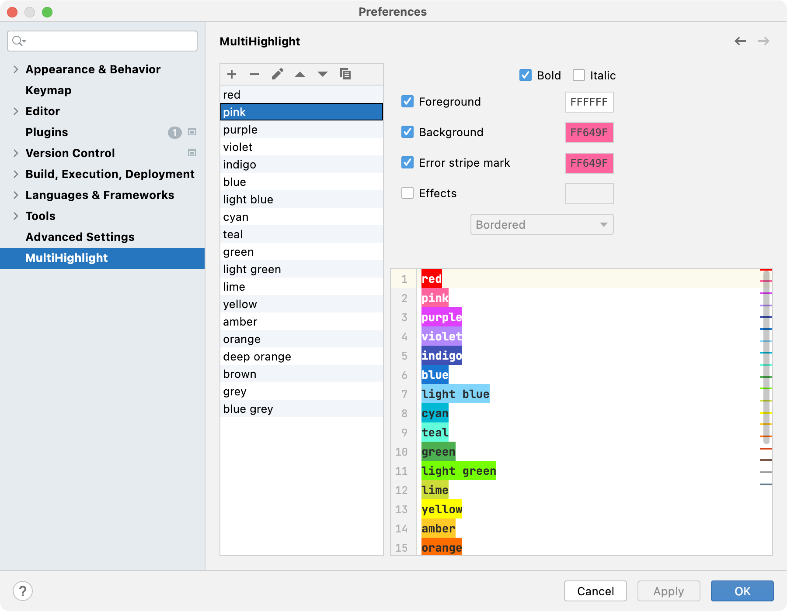

# MultiHighlight

<!-- Plugin description -->
Highlight identifiers with custom colors, helpful for reading source code.

Default shortcut: <kbd>Ctrl + '</kbd> and <kbd>Ctrl + Shift + '</kbd> (or <kbd>⌘ + '</kbd> and <kbd>⌘ + ⇧ + '</kbd> on mac).

<!-- Plugin description end -->

## Install
To install MultiHighlight, you have two options:

1. Install directly in the IDE:
- Go to **File | Settings | Plugins | Marketplace**.
- Search "MultiHighlight" then click install.

2. Install from file:
- Download MultiHighlight.zip in [Releases](https://github.com/huoguangjin/MultiHighlight/releases).
- Go to **File | Settings | Plugins**, click on the gear icon on the top-right corner of the window, select "Install Plugin from Disk", navigate to the location of your downloaded zip file then select it and click ok.

## Features

### Highlight identifiers
- Highlight variables, methods or classes with custom colors.
- Show highlighted strip marks on the scrolling bar for easy navigation.
- Show the number of highlights on the status bar for quick reference.

### Highlight control flow
Highlight control flow keywords such as return or throws to make them stand out.

|  |  |
|-----------------------------------------------------|--------------------------------------------------------|

### Highlight plain text
Select and highlight plain text in log files, documents or code comments.

### Highlight with specified color
Choose specified color to highlight, default shortcut: <kbd>Ctrl + Shift + '</kbd> (or <kbd>⌘ + ⇧ + '</kbd> on mac).
> Tips: press the shortcut twice will highlight with the default color.

### Clear all Highlights
The action to clear all highlights in current editor is not assigned to a keyboard shortcut by default.
If you need it, add keyboard shortcut in settings: File | Settings | Keymap | search "MultiHighlight".

### Customize color palette
Customize your highlight text style (bold/italic, foreground, background, stripe and effect style) in setting page.
> Tips: Here is [material design color palette](palette.json), they are bright and vibrant colors. ([what is material design?](https://material.io/guidelines/style/color.html))

## Build & Run

+ JDK 11 is required, set `JAVA_HOME` environment variable, or set **Build, Execution, Deployment | Build Tools | Gradle | Gradle JVM** in IDEA settings.

+ To build MultiHighlight, clone and run `./gradlew buildPlugin`.

+ To run IntelliJ IDEA with MultiHighlight installed, run `./gradlew runIde`.

## Change Log

check [CHANGELOG.md](CHANGELOG.md) for details.
